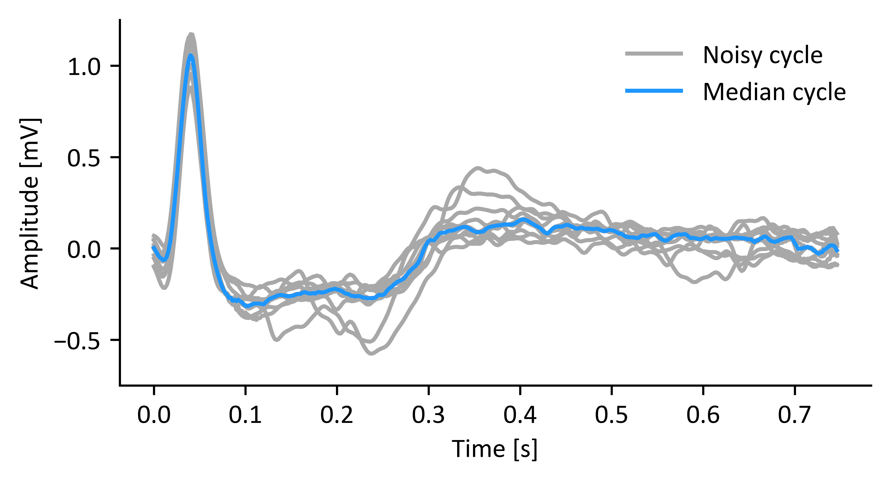
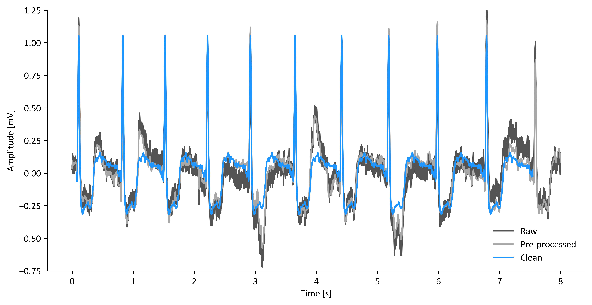

# ECG Noise Removal Using Segmented-beat Modulation
---
This is the Python and MATLAB implementation of the algorithm proposed in
the paper:

Agostinelli, Angela, Corrado Giuliani, and Laura Burattini. ["Extracting a clean ECG from a noisy recording: a new method based on segmented-beat modulation.""](<https://ieeexplore.ieee.org/abstract/document/7042976>). Computing in Cardiology Conference (CinC), 2014. IEEE, 2014.

Full credit goes to the authors.

This technique computes a template based on the median of several cardiac cycles:

Then, it uses this template to reconstruct cardiac cycles of a clean ECG. The
duration of these cycles matches that of the corresponding beats in the
original (noisy) recording:

A sample ECG data is included (as a .mat file) for quick testing of the
algorithm.
